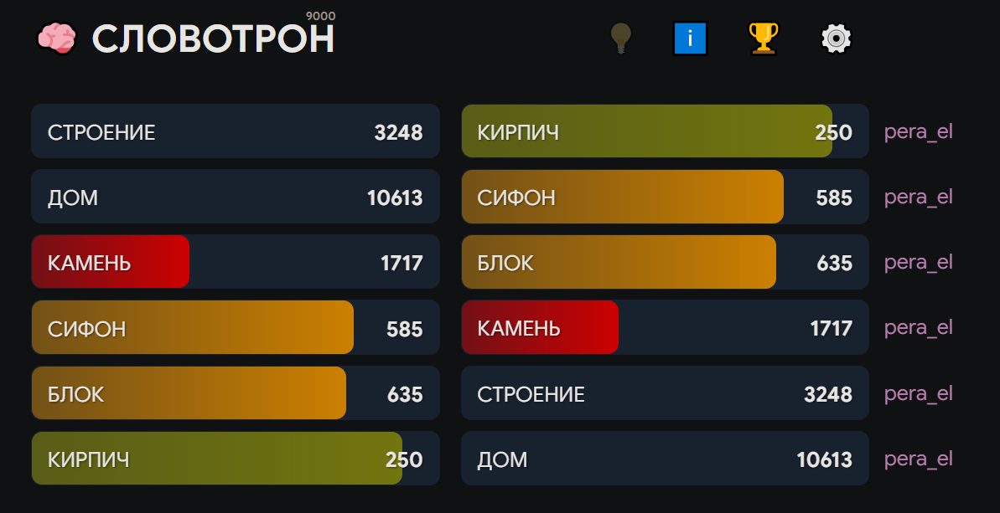
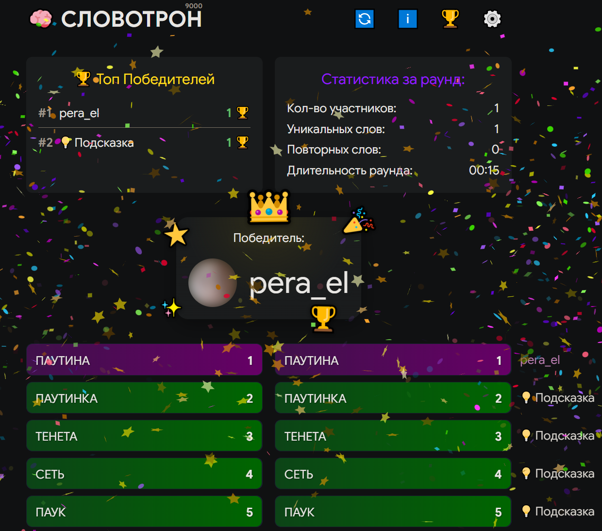
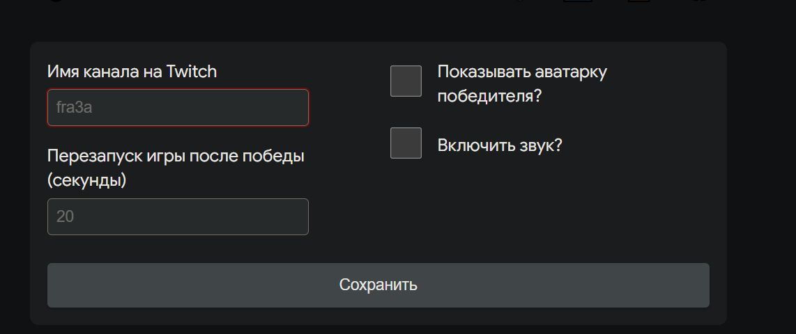

# 🧠 Словотрон 9000

**Словотрон 9000** — интерактивная игра для стримеров на Twitch. Зрители угадывают секретное слово, отправляя слова в чат. Побеждает тот, кто найдёт слово с минимальной семантической дистанцией до загаданного.

🔗 **Играть:** [slovotron.fra3a.ru](https://slovotron.fra3a.ru)

---

## Скриншоты

<!-- Добавьте скриншоты игры сюда -->

---

## Как это работает

Игра загадывает случайное слово через API [контекстно.рф](https://контекстно.рф), которое не показывается участникам. Зрители пишут слова в чат стримера — игра в реальном времени проверяет каждое слово и показывает его **дистанцию** до загаданного.

**Дистанция** — число от 1 до ~10000, показывающее семантическую близость между словами (на основе эмбеддингов). Чем меньше число, тем ближе слово к ответу. **Дистанция 1 = победа.**

Например, если загадано слово *«кот»*:
- «животное» → дистанция ~30
- «кошка» → дистанция ~5
- «кот» → дистанция 1 🎉

---

## Возможности

- **Живая лента угадываний** — все слова из чата с дистанцией появляются на экране в реальном времени
- **Лучший результат** — отдельно выделяется самое близкое слово за раунд
- **Подсказки** — команда `!подсказка` в чате запускает голосование; если проголосовало ≥50% участников, игра раскрывает подсказку (с кулдауном 1 минута)
- **Таблица победителей** — хранит историю побед прямо в браузере
- **Статистика раунда** — количество участников, уникальных и повторных слов, длительность
- **Анимация победы** — конфетти, фейерверки и звук при победе
- **OBS Overlay** — специальный режим для добавления игры как браузерного источника в OBS
- **Настраиваемые параметры** — таймер перезапуска, аватарка победителя, звук

---

## Как подключить к своему стриму

1. Открой [slovotron.fra3a.ru](https://slovotron.fra3a.ru)
2. Нажми ⚙️ и введи название своего Twitch-канала
3. Нажми «Сохранить» — игра подключится к чату
4. *Опционально:* скопируй **ссылку для OBS** и добавь её как браузерный источник в стриминговой программе

Зрители сразу могут начинать писать слова в чат — без команд, просто слова.

---

## Для разработчиков

Список актуальных задач и их обсуждение — в [Issues на GitHub](https://github.com/AnnaCodit/Slovotron/issues).

**Ветки:**
- `dev` — все доработки и фичи закидывать сюда через Pull Request
- `main` — стабильная версия, автоматически деплоится на [slovotron.fra3a.ru](https://slovotron.fra3a.ru) через GitHub Actions
